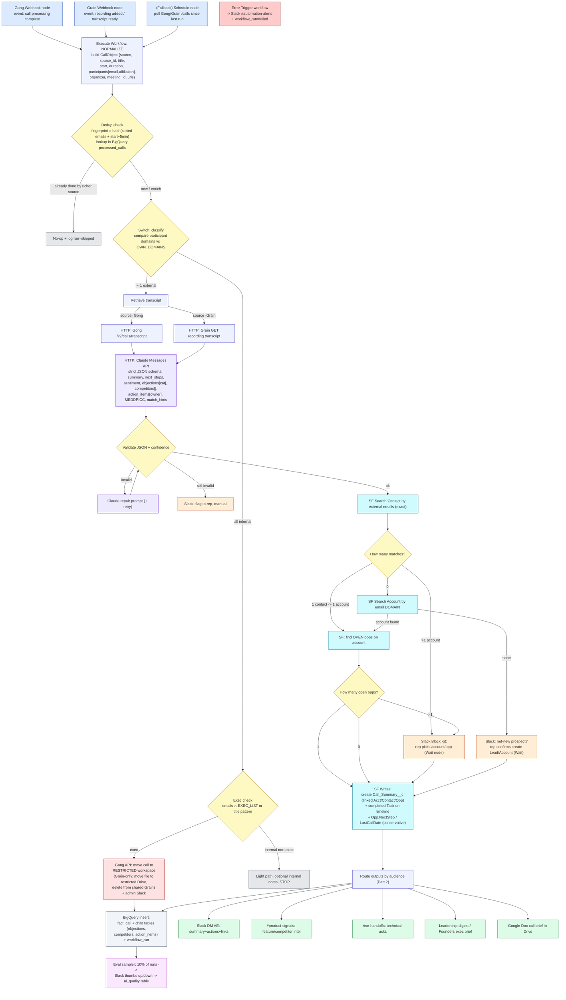

# Gambit — GTM Engineer Take-Home

**Automated Post-Call Workflow**
Author: Omri Gonen · Date: 2026-06-07

---

## 0. TL;DR / Design philosophy

I treat this as an **operator** would, not a strategist. The hard parts of this
problem are not "send transcript to AI." They are:

1. **Two sources of truth for the same call** (Gong recording *or* Grain-only
   transcript, sometimes both) → I need a normalize + **dedup** layer.
2. **Classification + restricted routing** for internal exec calls → a wrong
   classification leaks an exec call into the general library. This must
   fail *closed* (when unsure, restrict).
3. **Matching a call to the right SF account/contact/opportunity** when the
   only signal is a list of attendee emails → exact, fuzzy, and
   **human-in-the-loop** fallbacks; never write blind.
4. **Proving the AI output is actually good** → a lightweight **eval loop**
   and confidence thresholds, because the assignment explicitly weights this.
5. **Storing every run structurally** so the business can ask retrospective
   questions later.

Everything below is built around those five.

---

## 1. Tooling choice (and why)

**Orchestration engine: n8n.**
Why I commit to it over Clay/native-Zapier:

- It is the only in-scope tool that gives me **webhook triggers, branching
  (Switch/IF), a Wait-for-webhook node for human-in-the-loop, HTTP Request
  nodes for any REST API (Gong, Grain), native nodes for Salesforce / Slack /
  Google / BigQuery, and a global Error Trigger workflow** — in one canvas.
- **Self-hostable** → exec-call transcripts can be processed inside our own
  VPC, which matters for the "restricted area" requirement.
- **Sub-workflows (Execute Workflow node)** let me build one reusable
  "process a call" pipeline and call it from two different triggers (Gong and
  Grain) — DRY and testable.

Clay is excellent and I *do* use it — but for **enrichment**, not as the spine.
Gong/Grain are the call hubs, Salesforce is the source of truth, Claude does
extraction, BigQuery is the analytics store. (Justifications inline.)

---

## 2. Flow diagram (Mermaid — renders in any Mermaid viewer / GitHub / Notion)



---

## 3. Part 1 — Written spec, node by node

> Convention: **[Node type]** `operation` — *trigger/event* — **in →** data **out →** data — **edge cases**.

### 3.1 Triggers (two front doors, one pipeline)

- **[Gong Webhook node]** — *event: Gong automation rule / webhook fires when a
  call finishes processing & transcription is ready.* The payload carries
  `callId`, `title`, `started`, `duration`, `parties[]` (with `emailAddress`,
  `affiliation` Internal/External, `name`). **out →** raw Gong event.
  - *Edge:* not all Gong tiers push per-call webhooks reliably → **fallback
    [Schedule node]** every 5 min calling `GET /v2/calls?fromDateTime=<last_run>`
    and diffing against `processed_calls`. Belt-and-suspenders.

- **[Grain Webhook node]** — *event: Grain "recording added" webhook (covers the
  desktop-captured first-calls that never hit Gong).* Payload carries
  `recording_id`, `title`, `start_datetime`, `participants[]`, `url`.

Both triggers immediately call **[Execute Workflow node] → NORMALIZE**, so all
downstream logic is written once.

### 3.2 Normalize + dedup

- **[Code/Set node] "Build CallObject"** — **in →** Gong or Grain payload —
  **out →** a canonical object:
  `{ source, source_id, title, start_time, duration, participants:[{email,name,affiliation}], organizer_email, meeting_id, recording_url, transcript_ref }`.
  Domains are derived from each participant email here.

- **[Function node] "Fingerprint" + [BigQuery node] lookup** — compute
  `fingerprint = sha1(sorted(external+internal emails) + round(start_time,5min))`.
  Query `processed_calls`. **Decision [IF]:**
  - Seen, and the already-processed source is Gong (richer: speaker-separated,
    audio) → **stop/skip** (don't double-post). 
  - Seen via Grain but now Gong arrives → **enrich** the existing record
    (upgrade recording_url, re-run nothing else).
  - Not seen → continue. **This is what stops the "call exists in both systems"
    duplicate-Slack problem.**

### 3.3 Classification (internal vs external) + restricted routing

- **[Switch node] "Classify"** — compare every participant domain to a
  maintained `OWN_DOMAINS` list (stored as an n8n variable / small SF custom
  setting / Google Sheet so non-engineers can edit).
  - **All domains internal →** internal branch.
  - **≥1 external domain →** external branch (this is the only branch that runs
    the full customer pipeline, per the brief).

- **[IF node] "Exec check"** (internal branch) — is any participant email in the
  `EXEC_LIST` (maintained as a Google Group / SF custom setting), *or* does the
  title match exec patterns (e.g. "Board", "Leadership", "Exec")?
  - **Exec → [HTTP node] Gong API** move the call to the **restricted Gong
    workspace** (admin-only permission profile). For a **Grain-only** exec call
    there is no Gong object, so: **[Google Drive node]** move the transcript file
    to a restricted, admin-only Drive folder **and delete it from the shared
    Grain workspace**, then **[Slack node]** DM the admin. **No Salesforce write,
    no broadcast.** *Fail-closed:* if the exec check errors or is uncertain, it
    routes to restricted, not to general.
  - **Internal non-exec →** optional light handling (e.g. internal notes), then
    **stop**. The brief says the customer pipeline runs only for customer/prospect
    calls, so we don't summarize internal standups into Salesforce.

### 3.4 Transcript retrieval

- **[Switch on source]:**
  - **Gong → [HTTP Request node]** `POST /v2/calls/transcript` with `callId` →
    returns speaker-tagged transcript segments.
  - **Grain → [HTTP Request node]** `GET /recordings/{id}` (transcript JSON/VTT).
- **[Set node] "Unify transcript"** → single normalized text with speaker turns +
  metadata. **Edge:** transcript not ready yet (race) → **[Wait node]** retry
  with backoff up to N times; if still missing → Slack flag + `workflow_run=partial`.

### 3.5 AI extraction (Claude)

- **[HTTP Request node → Anthropic Messages API]** (model: a current Claude;
  I use Claude for long-context + reliable **structured JSON** + strong
  instruction-following on extraction). **in →** transcript + metadata + a strict
  prompt demanding a single JSON object:

  ```json
  {
    "summary": "...",
    "next_steps": ["..."],
    "sentiment": "positive|neutral|negative",
    "deal_signals": {"stage_hint": "...", "risk": "..."},
    "objections": [{"category":"pricing|competitor|timing|authority|integration|other","quote":"...","confidence":0.0}],
    "competitors": [{"name":"...","context":"...","sentiment":"..."}],
    "action_items": [{"owner":"AE|SE|Product|...","text":"..."}],
    "meddpicc": {"metrics":"...","economic_buyer":"...","decision_criteria":"...","pain":"...","champion":"..."},
    "match_hints": {"account_name":"...","domains":["..."],"attendee_emails":["..."]},
    "overall_confidence": 0.0
  }
  ```

- **[IF node] "Validate"** — parse JSON + schema check + `overall_confidence`.
  - Invalid JSON → **[HTTP] Claude "repair" prompt** (1 retry).
  - Still invalid OR confidence below threshold → **[Slack node]** route to the
    rep for manual review (don't write garbage to the source of truth).

> **Why this earns the grade:** the categories are **enums**, not free text —
> that's what makes Part 3's "every Q2 call where pricing was the objection"
> query possible. `match_hints` is generated specifically to feed the next step.

### 3.6 Salesforce matching (the crux — never write blind)

1. **[Salesforce node] Search Contact** by external participant emails (exact).
2. **[Switch] on result count:**
   - **1 contact → 1 account:** take `AccountId` → **[SF node] query open
     Opportunities** on that account.
   - **0 contacts:** **[SF node] Search Account by email domain**
     (`Website`/custom `Domain__c`).
     - Account found → proceed to opps.
     - None found → **net-new prospect** → **[Slack Block Kit + Wait node]**:
       ask the rep (the internal organizer = likely owner) to confirm
       create-Lead / create-Account before any write.
   - **>1 account (attendees span companies, e.g. partner on the call):**
     **[Slack Block Kit + Wait node]** → rep picks the correct account/opp;
     selection returns via a Slack interactivity webhook that **resumes** the
     paused workflow.
3. **[Switch] on open-opp count:**
   - 1 → use it.
   - >1 → human-in-the-loop pick (don't guess which deal).
   - 0 → write at account/contact level (no opp link).
4. **Owner routing:** the AE = Opportunity/Account owner in SF (or the internal
   organizer) → used to address the Slack DM to the right human.

**Ambiguity/missing is handled explicitly, not ignored** — exactly the bar the
brief sets with its dedupe example.

### 3.7 Salesforce writes (conservative — it's the source of truth)

- **[SF node] Create `Call_Summary__c`** custom record linked via
  `Account__c / Contact__c / Opportunity__c`. Fields: summary, next_steps,
  sentiment, source (Gong/Grain), recording_url, transcript_url, competitors,
  objections, MEDDPICC, ai_confidence, `workflow_run_id`.
- **[SF node] Create completed Task/Event** on the Contact/Opp timeline (so reps
  see it where they already work).
- **[SF node] Update Opportunity** — only safe fields: `NextStep`,
  `Last_Call_Date__c`, competitor field. **I deliberately do NOT auto-advance
  Stage** — I *suggest* a stage in the summary and let the rep move it. Auto-
  mutating stage on AI inference would corrupt the source of truth.

### 3.8 Output routing

- **[Slack node] DM the AE** — summary + action items + record links.
- **[Slack] #product-signals** — feature requests + competitor intel (Product).
- **[Slack] #se-handoffs** — technical/integration asks (Solution Engineering).
- **[Slack] leadership digest** + **founders exec brief** for strategic accounts.
- **[Google Docs node]** — formatted call brief in Drive, linked back from
  `Call_Summary__c`.
  (What exactly each audience gets is defined by the Part 2 discovery, below.)

### 3.9 Cross-cutting reliability (the "scale/capabilities" layer)

- **[Error Trigger workflow]** (global) → Slack `#automation-alerts` + write a
  `workflow_run` row with `status=failed`, failing node, payload pointer.
- **Idempotency** via the fingerprint + `processed_calls`.
- **Eval/QA loop:** **[Sampler]** ~10% of runs post the AI summary back to the AE
  with 👍/👎 (and "what was wrong") → logged to `ai_quality`. This is how we
  *prove the output is good over time* and catch drift — directly answering the
  brief's "confirm the output is actually any good."
- **Backfill mode:** the same NORMALIZE→AI→BigQuery sub-workflow can be run over
  historical Gong/Grain calls to populate the warehouse for retro analysis.

---

## 3.10 Node-contract table (the bar: node · event · data in/out · failure)

| # | Node (type · op) | Trigger / event | Data IN | Data OUT | Failure path |
|---|---|---|---|---|---|
| 1 | Webhook · Gong | call processing complete | callId, parties[] | raw event | missed → Schedule poll |
| 2 | Webhook · Grain | recording added | recording_id, participants[] | raw event | missed → Schedule poll |
| 3 | Code · Normalize | — | raw event | CallObject | malformed → error wf |
| 4 | Code · Fingerprint | — | CallObject | + fingerprint | — |
| 5 | BigQuery · MERGE claim | — | fingerprint | rows_affected | dup → stop (atomic) |
| 6 | Switch · Classify | — | participants[] | branch ext/int | low-conf → review |
| 7 | IF · Exec check | — | emails vs EXEC_LIST | branch | uncertain → restrict (fail-closed) |
| 8 | HTTP · Gong/Grain transcript | — | source_id | transcript text | not ready → Wait+retry → partial |
| 9 | HTTP · Claude (map/reduce) | — | transcript | insight JSON | invalid → repair → manual |
| 10 | IF · Validate | — | insight JSON | pass/fail | fail → Slack manual |
| 11 | SF · Search Contact | — | external emails | contact/account | 0/>1 → domain / HITL |
| 12 | Switch · Match count + Wait | — | results | 1/0/many | many → Wait+pick; timeout → escalate |
| 13 | SF · Create Call_Summary__c | — | insight + IDs | record id | error → error wf |
| 14 | Slack/Docs · Route | — | insight + links | messages | — |
| 15 | BigQuery · Insert | — | fact + children | row ids | always writes workflow_run |

## 3.11 Hardening — production-grade edge handling

These six close the gaps between a working demo and a system I'd trust in prod.

1. **Atomic dedup (race-safe).** Dedup is a *write*, not a read: a BigQuery
   `MERGE`/`INSERT … WHERE NOT EXISTS` into `processed_calls` returns
   `rows_affected`. `1` → I own the call, continue; `0` → another execution
   already claimed this fingerprint, stop. Backed by n8n queue-mode concurrency
   keyed on fingerprint. Converts the simultaneous-webhook race into a
   deterministic winner.
2. **Human-gate can't lose calls.** The HITL Wait node has a **24h resume
   limit**. On timeout: escalate to the rep's manager in Slack **and** persist
   `Call_Summary__c` in a `Needs Review` status (account-level, no opp), and
   write the call to BigQuery with `match_status='unresolved'`. The insight
   survives even if the human never answers.
3. **Long-transcript map-reduce.** An IF on estimated token count routes long
   calls through Split-In-Batches → Claude (map, per chunk) → Merge → Claude
   (reduce → final JSON). Short calls take the single-shot path. Bounds cost,
   latency, and context limits.
4. **Trustworthy quality signal.** Don't gate on the model's self-reported
   confidence. Gate on **structural truth**: all required schema fields filled,
   competitor names ∈ known allow-list, `match_hints` emails ∈ attendee list.
   Plus a ~30-call **golden set** run as regression on every prompt change.
5. **Exec exposure window — named, not hidden.** Grain transcribes before my
   flow can classify, so a brief shared-space window exists. The flow scrubs at
   detection time; the *real* zero-exposure fix is an upstream **Grain
   workspace-default policy** for exec users. I flag it as a dependency, not a
   thing n8n alone solves.
6. **Classification edge — personal-email prospects.** External attendees on
   free-email domains (gmail/outlook) skip the domain→account match and go
   straight to contact-email match / human confirm, so they aren't mis-bucketed.

---

## 4. Part 2 — Getting outputs to the right people (discovery, not assumptions)

General method for every team: **(a) interview 1–2 ICs + the manager, (b) ask
job-to-be-done questions, not "what report do you want," (c) co-define ONE
output, (d) validate against real past calls + a usage metric.** Outputs start
as a Slack message/Doc; only what proves used graduates to a SF field or a
dashboard.

### Account Executives
- **Who:** 2 AEs (one high-performer, one new), + the Sales Manager.
- **Ask:** "After a call, what do you retype into Salesforce by hand? What do you
  forget? What would let you skip CRM admin? What do you need before the *next*
  call?"
- **Outputs:** auto-drafted call summary + next steps on the Opp, a pre-filled
  `NextStep`, and a risk flag. Goal: kill manual CRM updates.
- **Validate:** run it on 10 of *their own* past calls — would they have sent it
  as-is? Then measure: % summaries edited vs accepted, and CRM-update time saved.

### Solution Engineering
- **Who:** 1–2 SEs + SE lead.
- **Ask:** "Which technical questions/integration/security asks get lost between
  the AE call and your follow-up? What context do you wish you had before you
  join?"
- **Outputs:** a `#se-handoffs` card listing technical requirements, integrations
  named, and security/compliance asks, with the transcript link.
- **Validate:** SEs confirm the extracted technical asks match reality on sample
  calls; track how many handoffs they accept without pinging the AE.

### Product
- **Who:** 1–2 PMs + a product analyst.
- **Ask:** "How do you hear customer pain today? What feature signal is too
  noisy/too late? What taxonomy do you already use?" (Adopt *their* taxonomy so
  data is mergeable.)
- **Outputs:** structured feature-request + competitor-intel feed (tagged to
  *their* themes) into `#product-signals` and BigQuery for trend analysis.
- **Validate:** PMs label a sample — does the AI's theme tagging agree with
  theirs (inter-rater check)? Trend lines must match their gut on known topics.

### Sales Leadership
- **Who:** VP Sales / Head of Sales.
- **Ask:** "What do you want to know across *all* deals each week? Which deals
  need your attention? What objection/competitor trends matter for forecasting?"
- **Outputs:** a weekly digest — objection mix, competitor mentions trending,
  at-risk deals, sentiment by stage. Aggregate, not per-call.
- **Validate:** does the digest's "at-risk" list match deals they already worried
  about? Calibrate thresholds with them before automating.

### Founders
- **Who:** the founder(s) directly.
- **Ask:** "Which accounts/themes do you personally want eyes on? Strategic
  signals vs noise? How much detail — one line or a brief?"
- **Outputs:** a short exec brief for strategic/at-risk accounts + emerging
  market/competitor narrative. Plus the restricted-exec-call handling stays
  admin-only.
- **Validate:** founder reads 3 briefs, tells me what they'd cut/add; success =
  they forward it / act on it, not just receive it.

---

## 5. Part 3 — Storage & retrospective analysis

### 5.1 Where, and why
**Google BigQuery** as the analytics store (Salesforce stays the operational
source of truth). Why BigQuery over SF reports / a Sheet / Postgres:
- The questions are **flexible, ad-hoc, time-series and trending** across *all*
  calls ("how often is Competitor X coming up, is it trending"). That's a
  columnar-warehouse job, not a CRM-report job.
- It's **in scope (Google Workspace)**, cheap at this volume, SQL-native, and
  plugs straight into **Looker Studio / Sheets / Gemini** for the team-facing
  dashboards from Part 2.
- It cleanly separates **operational writes** (Salesforce) from **analytical
  reads** so heavy queries never touch CRM performance/limits.

### 5.2 Schema (star-ish)
**Dimensions:** `dim_account`, `dim_contact`, `dim_opportunity`, `dim_rep`
(mirrored from Salesforce IDs).

**Facts / child tables:**
- `fact_call` — `call_id` (PK), `fingerprint`, `source` (gong/grain),
  `call_date`, `duration`, `account_id`, `opportunity_id`, `rep_id`,
  `call_type` (internal/external/exec), `sentiment`, `overall_confidence`,
  `recording_url`, `transcript_url`, `workflow_run_id`.
- `call_objections` — `call_id`, `category` (enum), `quote`, `confidence`.
- `call_competitors` — `call_id`, `competitor_name`, `context`, `sentiment`.
- `call_action_items` — `call_id`, `owner_team`, `text`, `status`.
- `call_topics` / feature requests — `call_id`, `theme` (Product's taxonomy).
- `workflow_run` — `run_id` (PK), `call_id`, `started_at`, `status`
  (ok/skipped/partial/failed), `failed_node`, `ai_model`, `token_cost`,
  `node_durations`. (Observability + auditability.)
- `ai_quality` — `run_id`, `reviewer`, `thumb`, `notes` (the eval loop).
- `processed_calls` — `fingerprint`, `call_id`, `source`, `processed_at` (dedup).

**Relations:** child tables join to `fact_call` on `call_id`; `fact_call` joins
to dims on `account_id / opportunity_id / rep_id`; `workflow_run` 1:1-ish with a
call attempt.

### 5.3 Questions it must answer (concrete)
- "Every Q2 external call where `category='pricing'` was the top objection" →
  `fact_call` ⨝ `call_objections`, filter date + category, rank by confidence.
- "How often is Competitor X mentioned, monthly, is it trending?" →
  `call_competitors` grouped by month → time series.
- "Win-rate of deals where pricing was objected vs not" → join to
  `dim_opportunity.stage/closed`.
- "Talk-time / sentiment by rep / by stage" → `fact_call` ⨝ `dim_rep`/`dim_opportunity`.
- "Feature themes trending by segment this quarter" → `call_topics` ⨝ `dim_account`.

### 5.4 Write path (which nodes write what)
- **[BigQuery Insert node] at the end of the pipeline** writes `fact_call`
  (one row) + batch-inserts the JSON arrays into `call_objections`,
  `call_competitors`, `call_action_items`, `call_topics`.
- **The dedup node** writes/updates `processed_calls` at the start.
- **Every run** (success *or* via the **Error Trigger workflow**) writes one
  `workflow_run` row — so failures are queryable, not invisible.
- **The eval sampler** writes `ai_quality` from the Slack 👍/👎 response.
- Mapping: AI JSON fields → child-table columns 1:1; SF IDs resolved during
  matching → `fact_call` foreign keys; n8n execution metadata → `workflow_run`.

### 5.5 Governance, PII & retention (non-negotiable for a security company)

Transcripts and insights are PII; exec-call data is restricted. The store is
governed accordingly:

- **Dataset separation.** A `raw_transcript` dataset (admin-only — mirrors the
  Gong restricted area) is kept apart from an `insights` dataset (objections,
  competitors, aggregates) that analysts query. Analysts never touch raw
  transcripts.
- **Access control.** Row-level security on `fact_call` by rep/owner; BigQuery
  policy tags (column-level) on PII fields (emails, names) so they’re masked for
  non-privileged roles.
- **Encryption & residency.** CMEK (customer-managed keys) on both datasets;
  dataset region pinned to the required jurisdiction.
- **Retention & erasure.** Time-partitioned tables with a retention policy —
  raw transcripts purged after N quarters, aggregated insights kept longer.
  GDPR/right-to-erasure is honored by deleting on `call_id` across tables.
- **Audit.** `workflow_run` already records every write, so it doubles as the
  lineage/audit trail of who and what touched each record.

This is out of scope for a 4–5 hour build, but for Gambit specifically it would
be a day-one requirement, not an afterthought.

---

## 6. Why this should score 100 (self-assessment vs the rubric)

- **Specificity:** every step names the node, the exact trigger event, the data
  in/out, and a failure path.
- **Judgment:** dedup across Gong+Grain, fail-closed exec routing, conservative
  SF writes (no auto stage changes), human-in-the-loop on ambiguity.
- **Closes the loop on quality:** the eval sampler + confidence thresholds
  directly answer "confirm the output is actually good."
- **Depth over breadth:** goes deep on the three genuinely hard parts (dedup,
  matching, restricted routing) and on a storage layer that actually answers the
  retro questions.
- **Production-grade, not demo-grade:** §3.10 gives a node-by-node contract
  (event · data in/out · failure) and §3.11 hardens the six edges that separate
  a working demo from a trusted system — atomic race-safe dedup, a human gate
  that can't lose calls, long-transcript map-reduce, a quality signal that
  doesn't trust the model's self-rating, and an honestly-named exec-exposure
  limit that automation alone can't close.
